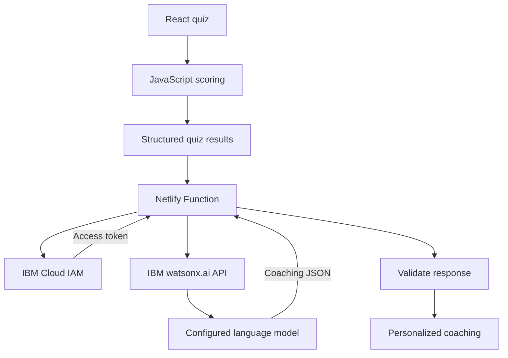

# AI Code Quiz

AI Code Quiz is a responsive learning application that helps beginner web developers assess their web-development knowledge and learn how to review AI-generated code safely.

[View the live application]((https://ai-code-quiz.netlify.app/))

## Problem statement

A beginner developer may use AI to generate code that looks correct but still contains logic, security, testing or accessibility problems. Because the learner may not know what to check, they need a simple way to assess their skills, identify knowledge gaps and learn how to review AI-generated code safely.

## Solution description

AI Code Quiz is a skills-assessment and coaching application for beginner developers. It assesses learners across web fundamentals, React and state, testing and debugging, and responsible AI coding.

After the quiz, the application identifies strengths and improvement areas, explains incorrect answers and uses IBM [watsonx.ai](https://www.ibm.com/products/watsonx-ai) to generate a personalized coaching plan.

This helps learners move from basic AI literacy to practical AI fluency—the ability to question, review, test and safely improve AI-generated code.

## AI approach and architecture

Once the quiz is submitted, the application uses deterministic JavaScript logic to calculate the overall score, category-level scores, strengths and improvement areas. AI is not used to mark answers or determine whether the learner passed.

When the learner requests personalized coaching, the React frontend sends the structured quiz results to a Netlify Function. The function validates the request, securely exchanges the server-side IBM Cloud API key for an IAM access token, and creates a coaching prompt based on the learner’s results and missed questions.

The function sends the prompt to the configured language model through the IBM watsonx.ai API. It then parses and validates the model’s response before returning the personalized coaching plan to the React frontend.



The Netlify Function acts as the secure backend boundary. IBM credentials are stored as Netlify environment variables and are never sent to the browser.

## Selected challenge theme

**Wildcard Challenge — Build Intelligent Systems for the Future of Work**

AI Code Quiz supports the future of software-development work, where developers increasingly collaborate with AI coding assistants. In this environment, knowing how to generate code is not enough; developers must also be able to question, review, test and safely improve AI-generated solutions.

The application helps beginner developers prepare for this change by assessing practical skills, identifying knowledge gaps and generating personalized coaching.

## How IBM Bob was used

IBM Bob was used as the primary development assistant throughout the AI Code Quiz development lifecycle.

* **Repository analysis:** Bob inspected the existing React application, identified the active quiz flow and distinguished it from the unused dashboard scaffold.
* **Planning:** Bob created implementation plans for the results-component refactor, category normalization, category-level scoring, personalized coaching and local attempt history.
* **Development:** Bob helped extract reusable components, implement deterministic scoring, connect the Netlify Function and build the coaching and attempt-history interfaces.
* **Refactoring:** Bob helped simplify the results page and remove unused pages, components, assets and dependencies.
* **Debugging:** Bob helped investigate failed tests, invalid model responses, watsonx.ai API errors and Netlify deployment problems.
* **Testing:** Bob created and updated unit, component, integration and Netlify Function tests.
* **Documentation:** Bob produced implementation plans, reports and development logs that were reviewed before each major development stage.

Human review remained part of the process. Plans were approved before implementation, generated changes were inspected, and tests, production builds and browser checks were used to verify the results.

## Built with

* React
* React Router
* JavaScript
* Tailwind CSS
* Jest
* React Testing Library
* Netlify
* Netlify Functions
* IBM Cloud IAM
* IBM watsonx.ai

## Run locally

Clone the repository:

```bash
git clone https://github.com/joanita-51/Quiz-App2.git
cd Quiz-App2
```

Install dependencies:

```bash
npm install
```

If npm reports peer-dependency conflicts:

```bash
npm install --legacy-peer-deps
```

To run the React frontend without the coaching function:

```bash
npm start
```

Open http://localhost:3000 in your browser.

To run the complete application with the local Netlify Function:

```bash
npx netlify dev
```

The coaching feature requires the server-side environment variables documented in `.env.example`. Do not commit real IBM Cloud credentials.

## Tests

Run the complete test suite:

```bash
npm test -- --watchAll=false
```

## Production build

```bash
npm run build
```

The production files are generated in the `build` directory.
